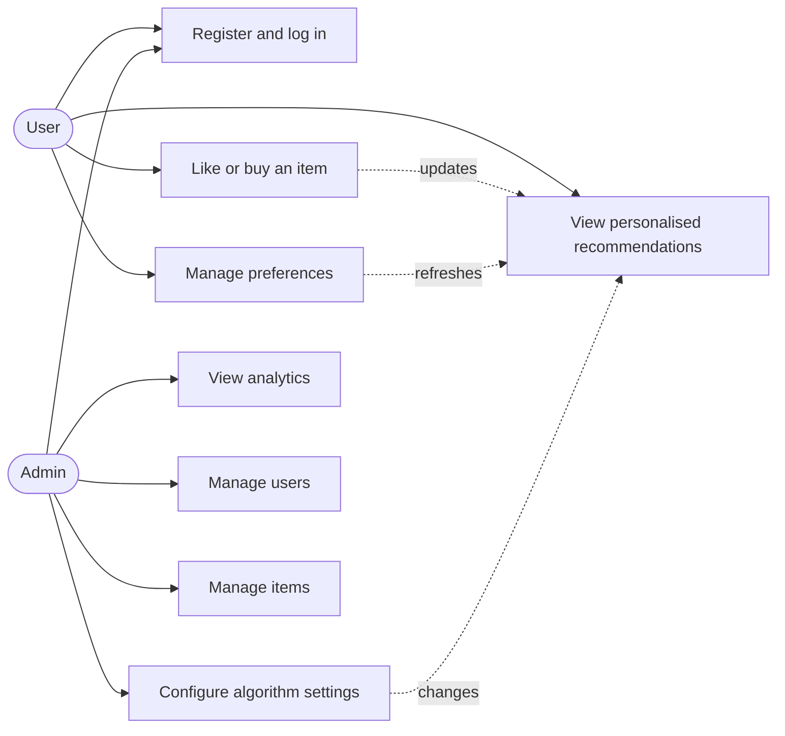
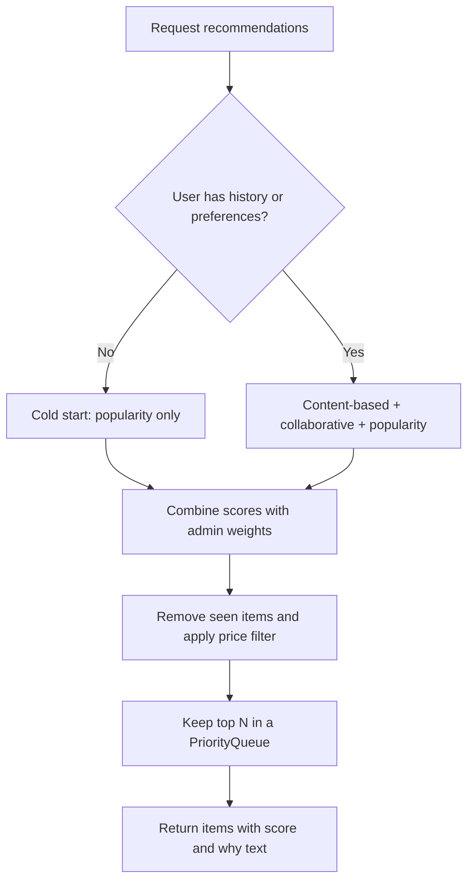

# Requirement analysis

## Problem
Users face too many products and need personalised suggestions. Operators need to see whether the suggestions
work and to tune the algorithm without changing code.

## Actors
- **User** - receives personalised recommendations and manages preferences.
- **Admin** - oversees settings, analyses recommendation data and manages users and items.

## Functional requirements
| ID | Requirement |
|---|---|
| F1 | A visitor can register and log in; passwords are stored as BCrypt hashes |
| F2 | A user sees a ranked list of recommended items, each with a score and an explanation |
| F3 | A user can like or buy an item; the action is stored and influences later recommendations |
| F4 | A user can update preferences (categories, price range); recommendations refresh afterwards |
| F5 | An admin can change algorithm weights and parameters; weights must sum to 1.0 and invalid input is rejected |
| F6 | An admin can view analytics: totals, interactions per category and per type |
| F7 | An admin can manage users and items |
| F8 | New users without history still receive recommendations (cold start) |

## Non-functional requirements
- Runs on a machine with only JDK 17 installed; no separate database or server
- Admin pages and admin APIs are unreachable for normal users
- State-changing requests are protected against CSRF
- Recommendation results are cached and refreshed in the background so requests stay fast
- Multi-step database changes are atomic (JDBC transactions)

## Use case diagram

## Recommendation flowchart

