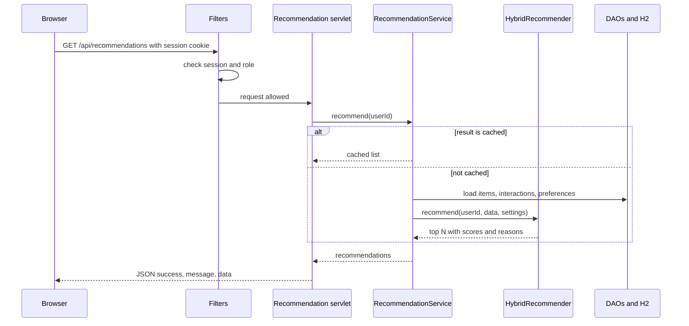
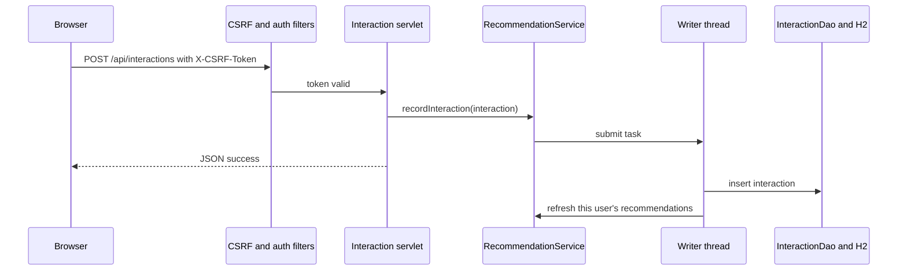
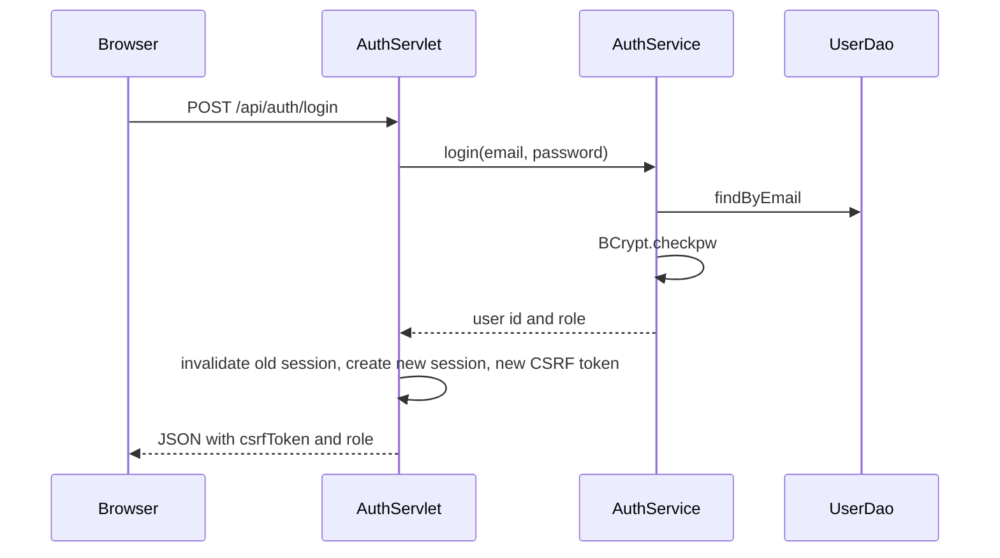

# Sequence diagrams

## Getting recommendations

```mermaid
sequenceDiagram
    participant B as Browser
    participant F as Filters
    participant S as Recommendation servlet
    participant R as RecommendationService
    participant H as HybridRecommender
    participant D as DAOs and H2
    B->>F: GET /api/recommendations with session cookie
    F->>F: check session and role
    F->>S: request allowed
    S->>R: recommend(userId)
    alt result is cached
        R-->>S: cached list
    else not cached
        R->>D: load items, interactions, preferences
        R->>H: recommend(userId, data, settings)
        H-->>R: top N with scores and reasons
    end
    R-->>S: recommendations
    S-->>B: JSON success, message, data
```

## Liking an item

```mermaid
sequenceDiagram
    participant B as Browser
    participant F as CSRF and auth filters
    participant S as Interaction servlet
    participant R as RecommendationService
    participant W as Writer thread
    participant D as InteractionDao and H2
    B->>F: POST /api/interactions with X-CSRF-Token
    F->>S: token valid
    S->>R: recordInteraction(interaction)
    R->>W: submit task
    S-->>B: JSON success
    W->>D: insert interaction
    W->>R: refresh this user's recommendations
```

## Login with session fixation protection

```mermaid
sequenceDiagram
    participant B as Browser
    participant A as AuthServlet
    participant S as AuthService
    participant D as UserDao
    B->>A: POST /api/auth/login
    A->>S: login(email, password)
    S->>D: findByEmail
    S->>S: BCrypt.checkpw
    S-->>A: user id and role
    A->>A: invalidate old session, create new session, new CSRF token
    A-->>B: JSON with csrfToken and role
```